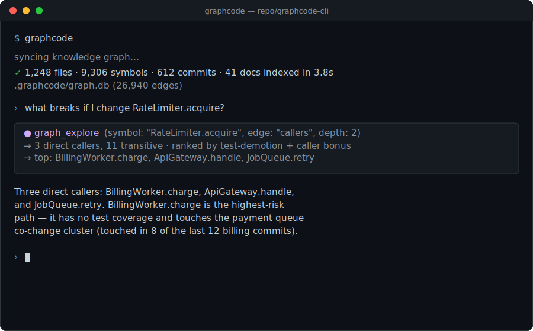
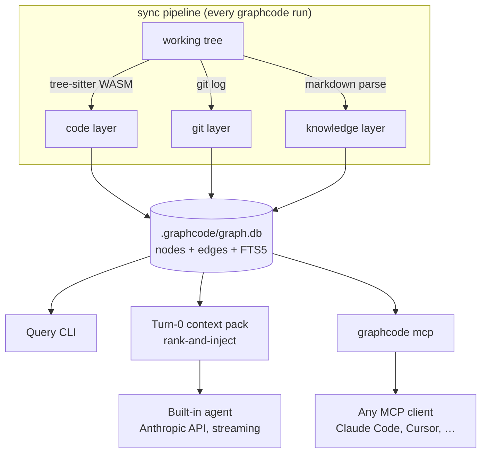

<p align="center">
  <picture>
    <source srcset="assets/logo-dark.svg" media="(prefers-color-scheme: dark)">
    <source srcset="assets/logo.svg" media="(prefers-color-scheme: light)">
    
  </picture>
</p>
<p align="center">The graph-native coding agent and context engine.</p>

<p align="center">
  <a href="https://github.com/ericnerwala/GraphCode/actions/workflows/ci.yml"></a>
  <a href="LICENSE"></a>
  <a href="package.json"></a>
  <a href="https://github.com/ericnerwala/GraphCode"></a>
</p>

<p align="center">
  
</p>

---

Every time you start GraphCode, it indexes your repo into a knowledge graph — code structure, git
history, docs, features — stored locally at `.graphcode/graph.db`. Then it either runs its own
agent with that graph injected before the first token, or serves the graph to any MCP-capable
agent (Claude Code, Cursor, ...). Zero native dependencies: `node:sqlite` + tree-sitter WASM.

## Installation

```bash
npm install -g github:ericnerwala/GraphCode
```

(npm publish to the `graphcode` package name is planned; until then, install from GitHub.)

Requires **Node >= 22.5** (for the built-in `node:sqlite` module — no native addon, no `better-sqlite3`).

## Quickstart

```bash
cd your-repo
graphcode
```

That's it — GraphCode syncs the graph (fast on repeat runs; only changed files are re-parsed) and
drops you into a chat with its built-in agent, which already has a ranked context pack for
whatever you ask about:

```
$ graphcode
✓ 1,248 files · 9,306 symbols · 612 commits · 41 docs indexed in 3.8s

› what breaks if I change RateLimiter.acquire?
```

`graphcode` (bare) needs an Anthropic API key. If none is configured, an interactive terminal
walks you through `graphcode auth login` on the spot (stored in `~/.config/graphcode/auth.json`);
non-interactive runs (scripts, pipes) instead print a hint to run `graphcode auth login` or set
`ANTHROPIC_API_KEY`. Without a key, the query CLI below works with zero setup and zero cost.

### Use it from Claude Code instead

Point Claude Code at the same graph over MCP, one line:

```bash
claude mcp add graphcode -- graphcode mcp
```

No API key needed for this path — `graphcode mcp` just serves the graph. See
[docs/mcp.md](docs/mcp.md) for Cursor and other clients.

## How it works



GraphCode indexes three layers into one unified node/edge space (full detail in
[docs/architecture.md](docs/architecture.md)):

- **Code layer** — files, symbols, calls, imports, extends/implements/references, tests edges.
  TypeScript, TSX, JavaScript, Python, Go, Java, Rust via tree-sitter WASM grammars.
- **Git layer** — commit nodes, `touched_by` edges, and co-change coupling mined from history (so
  impact analysis can surface files that are coupled in practice, not just by static reference).
- **Knowledge layer** — Markdown docs/specs as nodes with `mentions` edges, and feature nodes
  clustered from conventional-commit scopes.

| Edge kind | Layer | Meaning |
|---|---|---|
| `contains` | code | file → symbol / symbol → nested symbol |
| `calls` | code | call site |
| `imports` | code | module import |
| `extends` | code | class/interface extension |
| `implements` | code | interface implementation |
| `references` | code | non-call use (type refs, reads) |
| `tests` | code | test → tested-code link |
| `touched_by` | git | file changed in a commit |
| `co_change` | git | historical co-change coupling (weighted) |
| `mentions` | knowledge | doc references file/symbol |
| `in_feature` | knowledge | commit/file clustered into a feature |

**Turn-0 injection.** Before the built-in agent's first response, GraphCode runs a deterministic
rank-and-inject step: FTS search + neighbor traversal + the structural impact ranker assemble a
token-budgeted context pack (default 6000 tokens) of the symbols and files most relevant to your
request — so the agent starts with the graph's answer to "what's relevant here" already in hand,
instead of discovering it one grep at a time. Full design and a sample pack in
[docs/agent.md](docs/agent.md).

## Reliability guards

Turn-0 injection uses the graph to shape the agent's **input**. The reliability guards use it to
check the agent's **output** — so the graph is a guardrail on every edit, not just context at the
start. All four are **off by default** (the harness behaves exactly as before until you opt in via
`graphcode.json`) and none can ever throw into the agent loop: they only append advisory text.

- **Live graph sync.** After the agent writes or edits a file, GraphCode re-indexes *that one file*
  in place — parse → re-resolve edges → scoped pending-ref pass, all in a single transaction — so
  every subsequent `graph_*` query and every guard below reflects the agent's own change, not the
  stale index from session start. This is the foundation the other three build on.
- **Pre-edit impact guardrail.** The blast radius of the symbols being changed rides *on the edit's
  own result* (`[impact guard] 3 file(s) depend on symbols in this file …`), so the agent can't
  finish a change to a widely-used symbol without seeing who depends on it. A hard symbol-count cap
  keeps it cheap; leaf helpers with a trivial blast radius stay silent.
- **Post-edit verification.** After the re-index, GraphCode surfaces graph-level breakage the edit
  introduced: callers left stale by a removed or renamed symbol, references elsewhere that now
  resolve to nothing, imports that don't resolve to a repo file (`[verify] (high) src/main.ts
  previously referenced a symbol removed in src/helper.ts …`).
- **Completion gate.** When the agent tries to end the turn, an end-of-turn sweep over everything it
  wrote can hold the turn open with a follow-up if the graph still shows loose ends — a stale caller
  it never updated, a historically co-changing file it never opened. Bounded by a hard iteration cap
  and framed as "possible loose ends (may already be handled)", so a false positive costs one cheap
  acknowledgement, never a wrong edit.

Together they close the loop that turn-0 injection opens: the graph informs the first token *and*
audits the last one. Enable them per repo in [Configuration](#configuration); design notes in
[docs/agent.md](docs/agent.md).

## Why a graph

Agent context windows can't hold a 1M+ LOC codebase, and they shouldn't have to. The structure of
a codebase — who calls what, what's coupled by history, what a doc describes — is largely fixed
between edits. GraphCode **pre-computes that structure once at sync time**, so retrieval becomes
one ranked graph query instead of N speculative file reads. The graph doesn't replace the agent's
reasoning; it replaces the agent's *search*.

## Benchmarks

Retrieval-quality numbers below come from the experimental predecessor harness that GraphCode's
turn-0 injection and ranking design reimplements — not a benchmark of this repository's release
build. Full methodology, caveats, and a retracted-claim writeup: **[docs/benchmarks.md](docs/benchmarks.md)**.

| | Graph-native | Plain agent | Graph-as-MCP-tool |
|---|--:|--:|--:|
| Impact analysis F1 (Hadoop, 14,574 files, n=3, 95% CI) | **0.79** | 0.56 | 0.50 |
| Cost per task | **$0.27–$0.31** | $0.53–$0.71 | $0.53–$0.71 |
| File reads / greps on CI-backed tasks | **0** | many | many |
| Retrieval-oracle F1 (24k-LOC TS/Python, n=8) | **0.768** | 0.314 | 0.702 |

The structural ranker alone (held out, n=9, never tuned on the eval set) lifts raw graph
blast-radius F1 from 0.169 to **0.519** at top-20, beating the unranked baseline on 9 of 9
held-out tasks. Small n, single model family, directional — see the doc above before citing any
of this.

**Measured on GraphCode itself (v0.1.0, reproducible):** indexing Apache Hadoop trunk —
13,344 Java files → 232k symbols / 290k edges (55k import, 3k extends, 3k implements) — takes
~11.5 min cold and **3.5 s** for the every-start incremental sync. On the same held-out gold
tasks (vendored in [`bench/`](bench/tasks-hadoop-impact.json) with a one-command oracle runner),
the structural ranker lifts mean impact F1 from 0.173 raw to **0.338**. That trails the mature
predecessor research engine's 0.519 — the gap is Java-resolution depth, tracked honestly in
[docs/benchmarks.md](docs/benchmarks.md).

## Commands

| Command | Requires API key | Description |
|---|:--:|---|
| `graphcode` | yes | Sync the graph, then chat with the built-in agent. |
| `graphcode index` | no | Sync the graph without starting the agent. |
| `graphcode search <query>` | no | Full-text search over symbols, files, and docs. |
| `graphcode callers <symbol>` | no | List callers of a symbol. |
| `graphcode callees <symbol>` | no | List callees of a symbol. |
| `graphcode impact <symbol\|file>` | no | Ranked blast-radius / impact analysis. |
| `graphcode explore <symbols...>` | no | Connect the call flow across named symbols, source inlined. |
| `graphcode context <query>` | no | Print the ranked context pack for a query. |
| `graphcode resolve <symbol>` | no | Resolve a name to its graph node(s) and location. |
| `graphcode stats` | no | Show index statistics (files, symbols, commits, edges by kind). |
| `graphcode export` | no | Export the graph (e.g. JSON) for external tooling. |
| `graphcode viz` | no | Launch the built-in dark-theme graph viewer. |
| `graphcode mcp` | no | Serve the graph over MCP to any MCP-capable client. |
| `graphcode workspace index` | no | Sync every repo listed in `workspaceRepos`. |
| `graphcode auth login` | no | Store an Anthropic API key for the built-in agent. |
| `graphcode auth status` | no | Show how the agent's API key resolves (env or stored). |

Every command accepts `--path <dir>` to target a repo other than the current directory.

## Configuration

Optional `graphcode.json` in your repo root — every field has a default, nothing is required:

```json
{
  "model": "claude-sonnet-5",
  "contextPackTokens": 6000,
  "maxCommits": 2000,
  "ignore": ["**/generated/**"],
  "workspaceRepos": ["../shared-lib"],
  "liveGraphSync": true,
  "postEditVerify": true,
  "completionGateEnabled": false
}
```

The [reliability guards](#reliability-guards) are opt-in. Turn them on per repo:

| Field | Default | Effect |
|---|---|---|
| `liveGraphSync` | `false` | Re-index each file the agent edits, in place, so the graph reflects its own changes mid-session. Foundation for the two below. |
| `editGuard` | `{ enabled: true, minImpactedFiles: 2, maxSymbolsPerFile: 40, … }` | Pre-edit blast-radius advisory. Only computes when an edit happens; `minImpactedFiles` suppresses spam on leaf helpers, `maxSymbolsPerFile` caps cost. |
| `postEditVerify` | `false` | Post-edit graph verification (stale callers, dangling refs, unresolved imports). Requires `liveGraphSync`. |
| `completionGateEnabled` | `false` | End-of-turn loose-ends sweep. `completionGateMaxIterations` (default 2) and `completionGateMinSeverity` (default `"high"`) bound how much it can nag. |

| Env var | Effect |
|---|---|
| `ANTHROPIC_API_KEY` | Used by the built-in agent if set; otherwise falls back to `graphcode auth login`. Not needed for the query CLI or `graphcode mcp`. |
| `GRAPHCODE_MODEL` | Overrides the default model (`claude-sonnet-5`). |
| `GRAPHCODE_QUIET` | Set to `1` to suppress progress output on stderr. |

Run `graphcode auth login` to store a key at `~/.config/graphcode/auth.json` instead of exporting
`ANTHROPIC_API_KEY` every session; `graphcode auth status` and `graphcode auth logout` manage it.
Full reference: [docs/configuration.md](docs/configuration.md).

## Cross-repo workspaces

Real systems are usually more than one repo. GraphCode indexes each repo into its own
`.graphcode/graph.db` and federates queries across them at read time — no shared database, no
cross-repo lock, so a 1M+ LOC system split across many repos stays as fast to sync as its
smallest member:

```bash
graphcode workspace index
graphcode search "rate limiter" --workspace
graphcode impact RateLimiter.acquire --workspace
```

Guide, including the large-monorepo/many-repo strategy: [docs/workspaces.md](docs/workspaces.md).

## Visualization

```bash
graphcode viz
```

Opens a built-in, dark-theme graph viewer in your browser — no external service, no account.
It renders a snapshot exported from your local `.graphcode/graph.db`.

## FAQ

**Does it need an API key?** Only for the built-in agent (bare `graphcode`). The query CLI and
`graphcode mcp` work with zero API key and zero external calls.

**Does it send my code anywhere?** The graph itself is 100% local (`.graphcode/graph.db`). The
built-in agent calls the Anthropic API the same way any Claude-based coding agent does; the query
CLI and `graphcode mcp` don't call any API at all.

**What languages are indexed?** TypeScript, TSX, JavaScript, Python, Go, Java, and Rust for the
code layer. Any language's Markdown docs are indexed for the knowledge layer.

**Does it need a database server?** No — one SQLite file per repo, via Node's built-in
`node:sqlite`. No Neo4j, no Postgres, no Redis, no message queue.

**How is this different from a graph exposed as an MCP tool?** Graph-as-MCP-tool still leaves
retrieval and ranking to the agent, in-context, one query at a time. GraphCode's built-in harness
does that ranking deterministically in the harness *before* the agent's first token — see
[docs/benchmarks.md](docs/benchmarks.md) for where that mattered and where it didn't.

**How does this compare to other graph-based coding tools?**

| | GraphCode | [Potpie](https://github.com/potpie-ai/potpie) |
|---|---|---|
| License | MIT | Apache-2.0 |
| Infrastructure | Embedded SQLite, zero native deps | Neo4j + Postgres + Redis + Celery |
| Setup | `npm install -g`, no services to run | Database + queue infrastructure to provision |
| Graph scope | Code + git history + docs/features | Code graph |

This is a factual comparison of infrastructure shape, not a claim that GraphCode's graph is
richer — Potpie's own graph out-performs an unranked baseline on the Java corpus in
[docs/benchmarks.md](docs/benchmarks.md). The infrastructure difference is real regardless: no
services to provision or operate for GraphCode's graph.

## Contributing

See [CONTRIBUTING.md](CONTRIBUTING.md) for dev setup, test conventions, and commit style.

## License

[MIT](LICENSE) © 2026 Eric Nerwala

## Acknowledgments

GraphCode's turn-0 injection and ranking design was validated in experiments run on top of two
projects, neither of which is GraphCode's code:

- **[pi](https://pi.dev)** by Mario Zechner — the experimental harness scaffolding used during
  design validation.
- **[codegraph](https://github.com/colbymchenry/codegraph)** by Colby Mchenry (MIT) — the graph
  engine used as the backend during that same validation research.

GraphCode is an original, standalone implementation of the design those experiments validated —
its own graph, its own storage layer, its own ranker — built from scratch for this repository.
Thank you to both projects for making that research possible.
