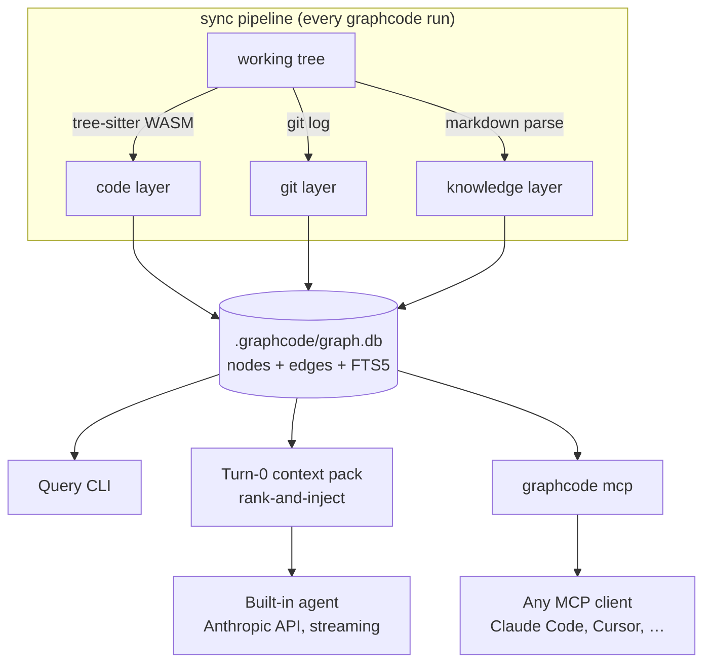

<p align="center">
  <picture>
    <source srcset="assets/logo-dark.svg" media="(prefers-color-scheme: dark)">
    <source srcset="assets/logo.svg" media="(prefers-color-scheme: light)">
    
  </picture>
</p>
<p align="center">The graph-native coding agent and context engine.</p>

<p align="center">
  <a href="https://github.com/ericnerwala/GraphCode/actions/workflows/ci.yml"></a>
  <a href="LICENSE"></a>
  <a href="package.json"></a>
  <a href="https://github.com/ericnerwala/GraphCode"></a>
</p>

<p align="center">
  
</p>

---

Every time you start GraphCode, it indexes your repo into a knowledge graph — code structure, git
history, docs, features — stored locally at `.graphcode/graph.db`. Then it either runs its own
agent with that graph injected before the first token, or serves the graph to any MCP-capable
agent (Claude Code, Cursor, ...). Zero native dependencies: `node:sqlite` + tree-sitter WASM.

**The idea:** a codebase's structure — who calls what, what's coupled by history, what a doc
describes — is largely fixed between edits. GraphCode pre-computes it once at sync time, so
retrieval becomes one ranked graph query instead of N speculative file reads. The graph doesn't
replace the agent's reasoning; it replaces the agent's *search* — and then guards its edits.

## Installation

```bash
npm install -g github:ericnerwala/GraphCode
```

Requires **Node >= 22.5** (for the built-in `node:sqlite` module — no native addon, no
`better-sqlite3`). npm publish to the `graphcode` name is planned; until then, install from GitHub.

## Quickstart

```bash
cd your-repo
graphcode
```

GraphCode syncs the graph (fast on repeat runs; only changed files are re-parsed) and drops you
into a chat with its built-in agent, which already has a ranked context pack for whatever you ask:

```
$ graphcode
✓ 1,248 files · 9,306 symbols · 612 commits · 41 docs indexed in 3.8s

› what breaks if I change RateLimiter.acquire?
```

`graphcode` (bare) needs an Anthropic API key; if none is configured, an interactive terminal walks
you through `graphcode auth login` on the spot. The query CLI and MCP server below need no key and
make no external calls.

### Use it from Claude Code instead

Point Claude Code at the same graph over MCP, one line:

```bash
claude mcp add graphcode -- graphcode mcp
```

See [docs/mcp.md](docs/mcp.md) for Cursor and other clients.

## How it works



GraphCode indexes three layers into one unified node/edge space (detail in
[docs/architecture.md](docs/architecture.md)):

- **Code layer** — files, symbols, and `calls` / `imports` / `extends` / `implements` /
  `references` / `tests` edges. TypeScript, TSX, JavaScript, Python, Go, Java, Rust via tree-sitter
  WASM grammars.
- **Git layer** — commit nodes, `touched_by` edges, and `co_change` coupling mined from history, so
  impact analysis surfaces files coupled in practice, not just by static reference.
- **Knowledge layer** — Markdown docs/specs as nodes with `mentions` edges, and feature nodes
  clustered from conventional-commit scopes.

**Turn-0 injection.** Before the built-in agent's first response, GraphCode runs a deterministic
rank-and-inject step — FTS search + neighbor traversal + a structural impact ranker assemble a
token-budgeted context pack (default 6000 tokens) of the symbols and files most relevant to your
request. The agent starts with the graph's answer to "what's relevant here" already in hand,
instead of discovering it one grep at a time. Design and a sample pack: [docs/agent.md](docs/agent.md).

## Reliability guards

Turn-0 injection uses the graph to shape the agent's **input**. The reliability guards use it to
check the agent's **output** — so the graph is a guardrail on every edit, not just context at the
start. All are **off by default** (the harness behaves exactly as before until you opt in via
`graphcode.json`) and none can throw into the agent loop — they only append advisory text.

- **Live graph sync** — after the agent writes or edits a file, GraphCode re-indexes *that one file*
  in place, in a single transaction, so every later `graph_*` query and guard reflects the agent's
  own change rather than the stale session-start index. Foundation for the rest.
- **Pre-edit impact guardrail** — the blast radius of the symbols being changed rides on the edit's
  own result, so the agent can't finish a change to a widely-used symbol without seeing who depends
  on it. A hard cost cap keeps leaf helpers silent.
- **Post-edit verification** — after the re-index, surfaces graph-level breakage the edit
  introduced: stale callers of a removed/renamed symbol, references that now dangle, imports that
  don't resolve.
- **Completion gate** — at end of turn, a bounded sweep can hold the turn open for graph-visible
  loose ends (a stale caller never updated, a co-changing file never opened), framed as *possible*
  issues so a false positive costs one cheap acknowledgement, never a wrong edit.

Enable per repo in [Configuration](#configuration).

## Benchmarks

**Measured on GraphCode itself (v0.1.0, reproducible):** indexing Apache Hadoop trunk —
13,344 Java files → 232k symbols / 290k edges — takes ~11.5 min cold and **3.5 s** for the
every-start incremental sync. On held-out gold impact tasks (vendored in
[`bench/`](bench/tasks-hadoop-impact.json) with a one-command oracle runner), the structural ranker
lifts mean impact F1 from 0.173 raw to **0.338**. Full methodology, caveats, and the gap to the
predecessor research engine: **[docs/benchmarks.md](docs/benchmarks.md)**.

## Commands

| Command | Requires API key | Description |
|---|:--:|---|
| `graphcode` | yes | Sync the graph, then chat with the built-in agent. |
| `graphcode index` | no | Sync the graph without starting the agent. |
| `graphcode search <query>` | no | Full-text search over symbols, files, and docs. |
| `graphcode callers <symbol>` | no | List callers of a symbol. |
| `graphcode callees <symbol>` | no | List callees of a symbol. |
| `graphcode impact <symbol\|file>` | no | Ranked blast-radius / impact analysis. |
| `graphcode explore <symbols...>` | no | Connect the call flow across named symbols, source inlined. |
| `graphcode context <query>` | no | Print the ranked context pack for a query. |
| `graphcode stats` | no | Show index statistics (files, symbols, commits, edges by kind). |
| `graphcode viz` | no | Launch the built-in dark-theme graph viewer. |
| `graphcode mcp` | no | Serve the graph over MCP to any MCP-capable client. |
| `graphcode workspace index` | no | Sync every repo listed in `workspaceRepos`. |
| `graphcode auth login` | no | Store an Anthropic API key for the built-in agent. |

Every command accepts `--path <dir>` to target a repo other than the current directory. Full list
in [docs/configuration.md](docs/configuration.md).

## Configuration

Optional `graphcode.json` in your repo root — every field has a default, nothing is required:

```json
{
  "model": "claude-sonnet-5",
  "contextPackTokens": 6000,
  "maxCommits": 2000,
  "ignore": ["**/generated/**"],
  "workspaceRepos": ["../shared-lib"],
  "liveGraphSync": true,
  "postEditVerify": true,
  "completionGateEnabled": false
}
```

The [reliability guards](#reliability-guards) are opt-in per repo — `liveGraphSync` is the
foundation the others build on. Full reference, including `editGuard` and completion-gate tuning:
[docs/configuration.md](docs/configuration.md).

| Env var | Effect |
|---|---|
| `ANTHROPIC_API_KEY` | Used by the built-in agent if set; otherwise falls back to `graphcode auth login`. Not needed for the query CLI or `graphcode mcp`. |
| `GRAPHCODE_MODEL` | Overrides the default model (`claude-sonnet-5`). |
| `GRAPHCODE_QUIET` | Set to `1` to suppress progress output on stderr. |

## Cross-repo workspaces

Real systems are usually more than one repo. GraphCode indexes each repo into its own
`.graphcode/graph.db` and federates queries across them at read time — no shared database, no
cross-repo lock, so a 1M+ LOC system split across many repos stays as fast to sync as its smallest
member:

```bash
graphcode workspace index
graphcode impact RateLimiter.acquire --workspace
```

Guide: [docs/workspaces.md](docs/workspaces.md).

## FAQ

**Does it need an API key?** Only the built-in agent (bare `graphcode`). The query CLI and
`graphcode mcp` work with zero key and zero external calls.

**Does it send my code anywhere?** The graph is 100% local (`.graphcode/graph.db`). The built-in
agent calls the Anthropic API the way any Claude-based coding agent does; the query CLI and
`graphcode mcp` call no API at all.

**What languages are indexed?** TypeScript, TSX, JavaScript, Python, Go, Java, and Rust for the
code layer; any language's Markdown docs for the knowledge layer.

**Does it need a database server?** No — one SQLite file per repo, via Node's built-in
`node:sqlite`. No Neo4j, no Postgres, no Redis, no queue.

## License

[MIT](LICENSE) © 2026 Eric Nerwala

## Acknowledgments

GraphCode's turn-0 injection and ranking design was validated in experiments run on top of
**[pi](https://pi.dev)** by Mario Zechner (harness scaffolding) and
**[codegraph](https://github.com/colbymchenry/codegraph)** by Colby Mchenry (MIT, the graph engine
used as backend during that research). GraphCode is an original, standalone implementation — its
own graph, storage layer, and ranker, built from scratch for this repository.
