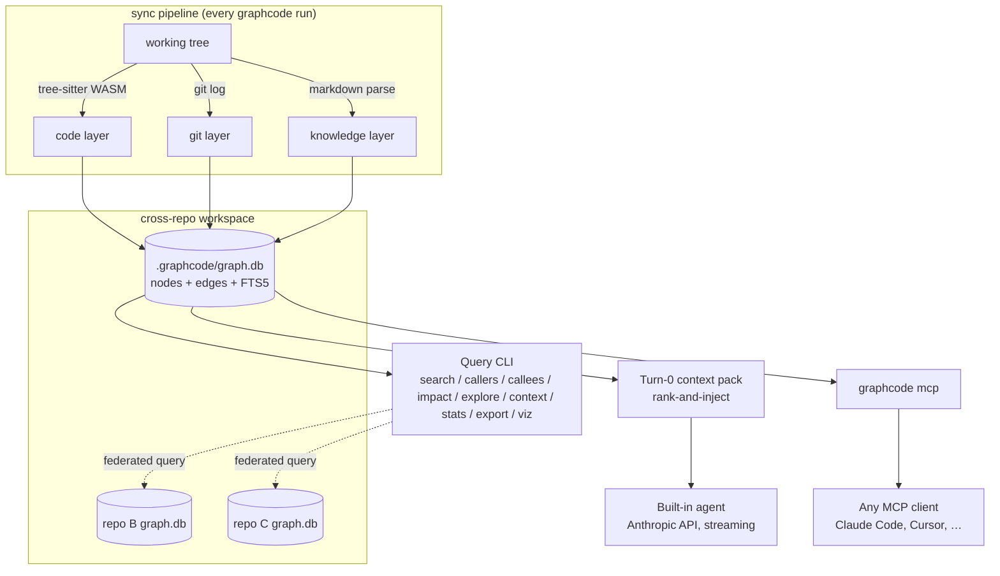

# Architecture

GraphCode indexes a repository into one embedded SQLite database — `.graphcode/graph.db` — and
serves every downstream feature (query CLI, built-in agent, MCP server) from that single graph.
This document describes the layers, the schema, the sync pipeline, and how cross-repo workspaces
federate multiple databases.

## The three layers

GraphCode's graph is unified: files, symbols, commits, docs, and features all live in one `nodes`
table, distinguished by `kind`. This is deliberate — it means a query like "what touches this
symbol" can walk from a code edge into a git edge into a doc edge without switching data models.

### 1. Code layer

Built by parsing source files with tree-sitter WASM grammars (no native addons). Produces:

- **file** nodes — one per source file, tagged with `language`.
- **symbol** nodes — functions, methods, classes, interfaces, types, enums, structs, traits,
  impls, variables, constants, modules (see `SymbolKind` in `src/graph/types.ts`).
- Structural edges: `contains`, `calls`, `imports`, `extends`, `implements`, `references`, `tests`.

Supported languages: TypeScript, TSX, JavaScript, Python, Go, Java, Rust.

### 2. Git layer

Built by walking `git log`. Produces:

- **commit** nodes.
- `touched_by` edges (file → commit).
- `co_change` edges (file ↔ file), weighted by co-change confidence mined from commit history —
  this is what lets impact analysis surface files that are *coupled in practice* even when
  there's no static import or call between them.

### 3. Knowledge layer

Built by parsing Markdown docs and specs in the repo. Produces:

- **doc** nodes, with `mentions` edges (doc → file, doc → symbol) resolved by matching identifiers
  and paths mentioned in the doc text.
- **feature** nodes, clustered from conventional-commit scopes (the `type(scope): ...` prefix) via
  `in_feature` edges (commit → feature, file → feature). This gives a feature-level view of the
  codebase without any manual tagging — it falls out of commit hygiene the project already has.

## Node and edge kinds

`NodeKind`: `file`, `symbol`, `commit`, `doc`, `feature`.

| Edge kind | Direction | Layer | Meaning |
|---|---|---|---|
| `contains` | file → symbol, symbol → symbol | code | structural nesting |
| `calls` | symbol → symbol | code | call site |
| `imports` | file → file | code | module import |
| `extends` | symbol → symbol | code | class/interface extension |
| `implements` | symbol → symbol | code | interface implementation |
| `references` | symbol → symbol | code | non-call use (type refs, reads) |
| `tests` | test file/symbol → tested file/symbol | code | test coverage link |
| `touched_by` | file → commit | git | file changed in commit |
| `co_change` | file ↔ file | git | historical co-change coupling (weighted) |
| `mentions` | doc → file, doc → symbol | knowledge | doc references code |
| `in_feature` | commit → feature, file → feature | knowledge | feature clustering |

## Schema

One SQLite database per repo (`schema.sql`), in WAL mode:

- `repos` — one row per indexed repo root (`name`, `root`, `head_sha`, `indexed_at`).
- `files_state` — incremental-sync bookkeeping: last-seen content hash, size, mtime per file, so
  re-running `graphcode` only re-parses what changed.
- `nodes` — the unified node table (`kind`, `subkind`, `name`, `qualified_name`, `file_path`,
  `start_line`, `end_line`, `language`, `signature`, `doc`, `exported`, `meta`).
- `edges` — `(src, dst, kind, weight, meta)`, unique on `(src, dst, kind)` so re-inserting the same
  edge during sync is an idempotent upsert.
- `pending_refs` — cross-file references recorded at extraction time that couldn't be resolved yet
  (the target file hadn't been parsed), re-resolved as more of the repo is indexed.
- `nodes_fts` — an FTS5 virtual table mirroring `nodes.id` as `rowid`, indexing `name`,
  `qualified_name`, a `tokens` column (camelCase/snake_case-split terms, so a search for
  "monotonic clock" matches `MonotonicClock`), and `doc`.

Indexes cover the hot paths: `(kind, name)`, `(repo_id, file_path)`, `qualified_name`,
`(src, kind)`, `(dst, kind)`.

## Sync pipeline

Every time you run `graphcode` (or `graphcode index` explicitly), the sync pipeline:

1. Opens (or creates) `.graphcode/graph.db` for the repo root.
2. Walks the working tree, respecting `.gitignore` plus any `ignore` globs in `graphcode.json`.
3. Hashes each file and diffs against `files_state` from the last sync — unchanged files are
   skipped entirely; changed or new files are re-parsed; deleted files have their subgraph
   removed (`deleteFileGraph`).
4. Re-parses changed files with the matching tree-sitter grammar, emitting nodes and edges for the
   code layer. Unresolved cross-file references are recorded in `pending_refs` and re-resolved as
   their target files are (re-)indexed.
5. Rebuilds the git layer (`deleteNodesByKind('commit')` then re-walk) up to `maxCommits` commits,
   and recomputes co-change weights.
6. Rebuilds the knowledge layer: re-parses Markdown docs for `mentions`, and re-clusters `feature`
   nodes from conventional-commit scopes.
7. Records the new `head_sha` and `indexed_at` on the `repos` row.

All writes for a sync pass go through `GraphStore`'s transaction wrapper, so a sync either commits
cleanly or rolls back — the graph is never left half-updated.

Sync is designed to be cheap enough to run on every invocation: on an unchanged repo it's a
file-hash diff and a no-op; only actual changes trigger re-parsing.

## Turn-0 context injection

When GraphCode runs its own agent (no MCP), it builds a **context pack** before the first token is
sent to the model: a deterministic rank-and-inject step that queries the graph for the symbols and
files most relevant to the user's request (via FTS search, neighbor traversal, and the structural
impact ranker) and assembles them into a token-budgeted preamble (`contextPackTokens` in
`graphcode.json`, default 6000). This replaces the usual "let the agent grep around" loop with one
precomputed, ranked answer to "what's relevant here" — see [docs/agent.md](agent.md) for the full
harness design and a sample pack.

## High-level flow

## Federation model

A **workspace** is a set of independently-indexed repos declared in one repo's `graphcode.json`
under `workspaceRepos` (paths absolute or relative to that repo's root). `graphcode workspace
index` syncs each member repo into its own `.graphcode/graph.db` — there is no shared database and
no cross-repo writes.

Federated operations (`search`, `impact`, and friends run in workspace mode) open each member's
`GraphStore` independently, run the same query against each, and merge results by score/rank in
the query layer. This keeps each repo's graph small and fast to sync, and keeps the storage model
identical whether you're running on one repo or ten — see
[docs/workspaces.md](workspaces.md) for the full guide and the 1M+ LOC strategy.
